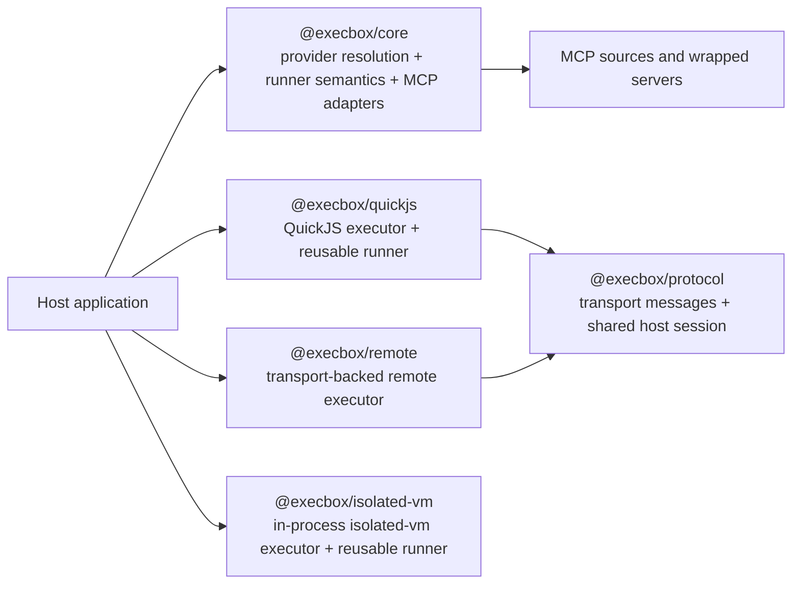
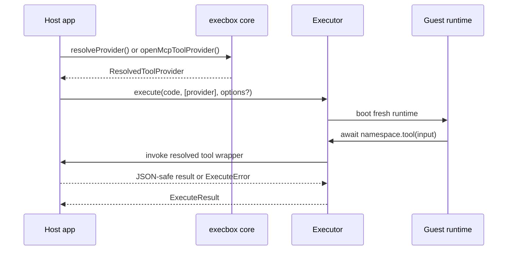
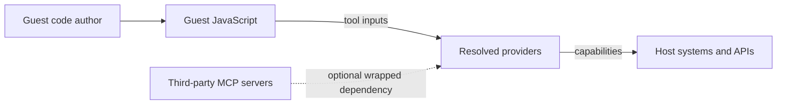

# Execbox Architecture Overview

Execbox is the code-execution part of the `execbox` workspace. It turns host tool catalogs into callable guest namespaces, lets those namespaces wrap MCP tools, and pairs with executor packages that decide where and how guest JavaScript runs.

This doc set is for two audiences:

- Integrators choosing packages and deployment shapes
- Contributors reasoning about package boundaries, control flow, and trade-offs

## Reading Guide

- Start here for the package map, trust model, and overall flow.
- Read [execbox-core.md](./execbox-core.md) for provider resolution, execution contracts, and error handling.
- Read [execbox-executors.md](./execbox-executors.md) for QuickJS host modes, remote execution, and `isolated-vm` trade-offs.
- Read [execbox-mcp-and-protocol.md](./execbox-mcp-and-protocol.md) for MCP wrapping and where `execbox-protocol` fits.
- Read [execbox-remote-workflow.md](./execbox-remote-workflow.md) for the end-to-end remote execution control flow.
- Read [execbox-protocol-reference.md](./execbox-protocol-reference.md) for the protocol message catalog and session rules.
- Read [execbox-runner-specification.md](./execbox-runner-specification.md) for the normative runner specification for non-TypeScript runners.

## Package Map

### Package Roles

| Package                | Role                                                                                                                         |
| ---------------------- | ---------------------------------------------------------------------------------------------------------------------------- |
| `@execbox/core`        | Core types, provider resolution, shared runner semantics, and MCP adapters                                                   |
| `@execbox/quickjs`     | Default QuickJS executor package with inline, worker-hosted, and process-hosted modes plus a reusable runner                 |
| `@execbox/remote`      | Transport-backed executor that reuses the QuickJS protocol endpoint across an app-defined boundary                           |
| `@execbox/isolated-vm` | Alternate executor backend using a fresh `isolated-vm` context and a reusable isolated-vm runner                             |
| `@execbox/protocol`    | Transport-safe execution messages, shared host sessions, and reusable resource pools for hosted QuickJS and remote execution |

## End-to-End Execution Model

At a high level, execbox always follows the same model:

1. Host code defines or discovers tools.
2. `@execbox/core` resolves those tools into a deterministic guest namespace.
3. An executor runs guest JavaScript against that resolved namespace.
4. Guest tool calls cross a host-controlled boundary and return structured JSON-compatible results.

## Trust Model and Security Posture

Execbox provides defense-in-depth controls around guest execution, but hard isolation still depends on the executor and deployment boundary you choose.

Key implications:

- The provider/tool surface is the capability boundary, not the JavaScript syntax itself.
- Fresh runtimes, schema validation, JSON-only boundaries, timeouts, memory limits, and bounded logs are defense-in-depth features.
- In-process execution still shares the host process. Use a separate process, container, VM, or similar boundary when the code source is hostile or multi-tenant.
- Wrapping third-party MCP servers is a separate dependency-trust decision from letting end users author guest code.

## Architecture In One Paragraph

`@execbox/core` owns the stable execution contract, provider resolution, shared runner semantics, and MCP adapters. `@execbox/quickjs` and `@execbox/isolated-vm` each expose a runtime-specific reusable runner. Hosted `@execbox/quickjs` modes and `@execbox/remote` sit on top of `@execbox/protocol`, which owns the transport boundary: message shapes, shared host sessions, and reusable resource pools for transport-backed execution.
