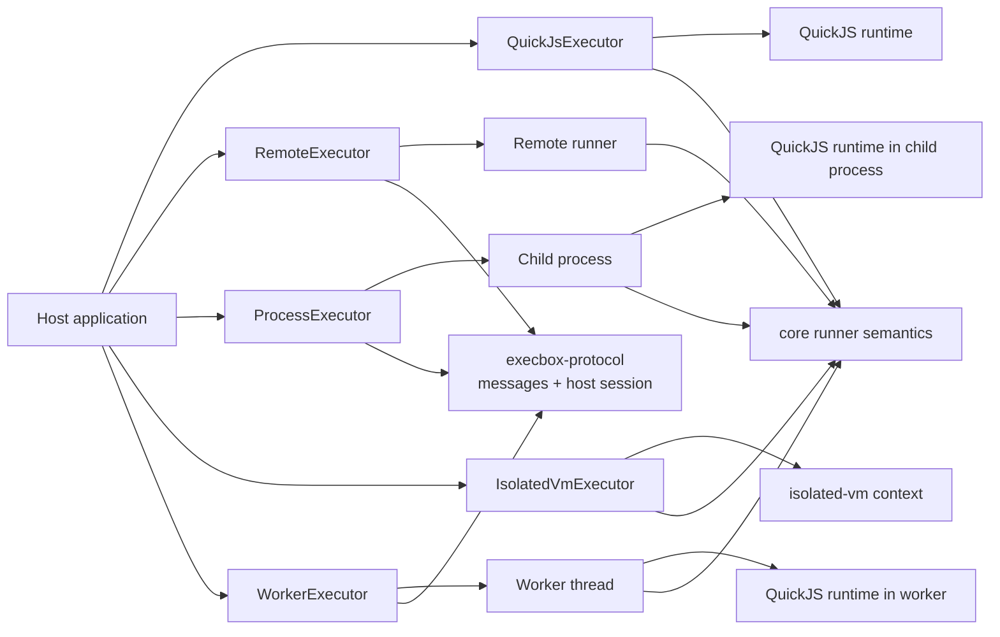
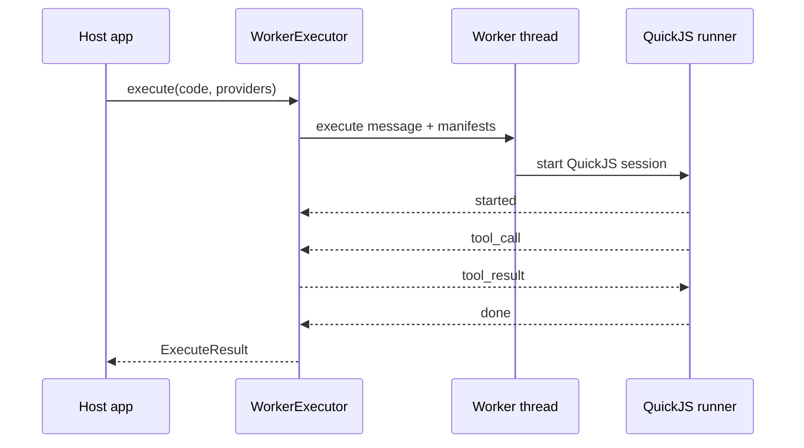
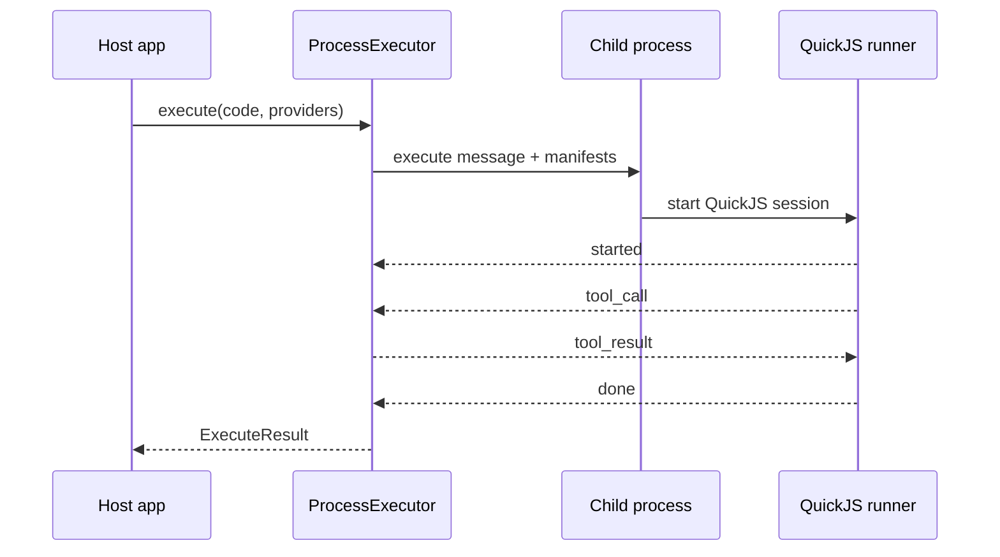

# Execbox Executors

This page explains how the current executor packages differ and what trade-offs they make.

## Executor Comparison

| Package                | Runtime boundary                       | Tool bridge style                 | Main strengths                                   | Main constraints                                     |
| ---------------------- | -------------------------------------- | --------------------------------- | ------------------------------------------------ | ---------------------------------------------------- |
| `@execbox/quickjs`     | Fresh in-process QuickJS runtime       | Shared runner callback            | No native addon, simple install, default backend | Still in-process                                     |
| `@execbox/remote`      | App-defined remote transport boundary  | Shared host session + transport   | Same API across a remote boundary                | You own transport/runtime deployment                 |
| `@execbox/process`     | Child process + fresh QuickJS runtime  | Shared host session + IPC         | Hard-kill process termination, pooled by default | Still not a container/VM; ephemeral mode is slower   |
| `@execbox/isolated-vm` | Fresh in-process `isolated-vm` context | Shared runner callback + ivm refs | Native V8 isolate semantics, no worker startup   | Native addon, `--no-node-snapshot`, still in-process |
| `@execbox/worker`      | Worker thread + fresh QuickJS runtime  | Shared host session + messages    | Hard-stop worker termination, pooled by default  | Still same OS process; ephemeral mode is slower      |

## QuickJS

`QuickJsExecutor` is the default reference implementation for execbox. It uses the shared runner semantics from `@execbox/core`: providers are converted to manifests, host tool calls are dispatched through the shared dispatcher helper, and the reusable QuickJS runner turns them back into guest-visible async functions.

That design gives QuickJS two useful properties:

- the runtime semantics are centralized in one runner implementation
- the same guest/tool-call model can be reused behind worker, process, and remote transport boundaries

## isolated-vm

`IsolatedVmExecutor` follows the same high-level runner contract as QuickJS, but keeps its native bridge internally. The reusable `runIsolatedVmSession()` runner accepts manifests and an `onToolCall` callback, then implements the runtime-specific bridge with `setSync()` / `applySyncPromise()` inside the `isolated-vm` context.

That means:

- it does not depend on `execbox-protocol`
- it avoids the extra message loop used by worker-backed execution
- its runtime-specific bridge logic still lives in the executor package itself
- it aligns to the same runner-level shape used by QuickJS and transport-backed execution

The package keeps its native bridge where it belongs while still sharing the same host-side manifest and tool-dispatch model as the other executors.

## Worker-Backed QuickJS

`WorkerExecutor` uses a worker thread for lifecycle isolation, but it does not invent a second scripting model. It loads the same QuickJS session runner used by the in-process QuickJS executor, reuses the shared QuickJS protocol endpoint inside the worker, and uses the shared `execbox-protocol` host session on the parent side. By default it keeps a worker shell warm between executions; `mode: "ephemeral"` switches to a fresh worker per execution.

## Process-Backed QuickJS

`ProcessExecutor` uses the same message-driven model as the worker executor, but runs it behind a child-process boundary. It loads the same QuickJS session runner used by the in-process QuickJS executor, reuses the same QuickJS protocol endpoint inside the child, and uses the shared `execbox-protocol` host session on the parent side. By default it keeps a child-process shell warm between executions; `mode: "ephemeral"` switches to a fresh child process per execution.

## Timeout, Memory, and Abort Trade-offs

The four executors expose the same public result shape, but they enforce limits differently.

| Concern             | QuickJS                                   | Remote                                                                     | Process                                                                 | isolated-vm                                     | Worker                                                                          |
| ------------------- | ----------------------------------------- | -------------------------------------------------------------------------- | ----------------------------------------------------------------------- | ----------------------------------------------- | ------------------------------------------------------------------------------- |
| Timeout             | QuickJS interrupt/deadline handling       | Shared host-session timeout + remote cancel + transport teardown           | Shared host-session timeout + process cancellation + `SIGKILL` backstop | `isolated-vm` timeout + host deadline helpers   | Shared host-session timeout + worker cancellation + worker termination backstop |
| Memory              | QuickJS runtime memory limit              | Remote runtime decides the hard boundary; execbox still forwards limits    | QuickJS runtime memory limit inside the child process                   | Isolate memory limit                            | QuickJS memory limit inside worker, optional worker resource limits as backstop |
| Abort to host tools | Abort signal passed through core callback | Abort signal passed through shared host session                            | Abort signal passed through shared host session                         | Abort signal passed through core callback + ivm | Abort signal passed through shared host session                                 |
| Log capture         | Captured inside runner                    | Captured inside the remote runner and returned over the transport boundary | Captured inside child-side QuickJS runner                               | Captured through injected console bindings      | Captured inside worker-side QuickJS runner                                      |

## Security and Operational Trade-offs

- All four executors provide defense-in-depth measures, not standalone hard hostile-code boundaries.
- QuickJS is the easiest operational default and has the cleanest shared runtime story.
- Remote execution keeps the same executor API while moving the runtime behind an app-defined boundary, but execbox deliberately does not ship the network stack for you.
- Process-backed QuickJS gives a stronger lifecycle split than worker threads, but it is still not equivalent to a container or VM boundary.
- `isolated-vm` is the most specialized option and carries the most environment-specific operational requirements.
- Worker-backed QuickJS improves lifecycle isolation and hard-stop behavior, but not process-level trust isolation.
- Worker and process executors share the same host-session and child-endpoint semantics, so most behavioral differences come from the transport boundary rather than from duplicated executor logic.

## Pooled QuickJS Shells

The QuickJS-backed executors that benefit from pooling can keep the expensive outer shell warm without reusing guest runtime state:

- `WorkerExecutor`: pooled-by-default reusable worker threads, with `mode: "ephemeral"` opt-out
- `ProcessExecutor`: pooled-by-default reusable child processes, with `mode: "ephemeral"` opt-out

Every `execute()` call still creates a fresh QuickJS runtime/context, reinjects providers, and discards guest globals afterward. Timeouts and internal transport failures evict the affected shell from the pool instead of returning it to circulation.

### How The Pool Works

Pooling is implemented at the host-shell layer, not at the QuickJS runtime layer.

- `@execbox/protocol` exposes a small bounded async `createResourcePool()` helper that owns reusable shells, idle eviction, and `prewarm()` / `dispose()` support.
- `ProcessExecutor` pools `ChildProcess` shells and `WorkerExecutor` pools `Worker` shells. Each shell owns one long-lived transport wrapper plus one attached QuickJS protocol endpoint.
- The child/worker entrypoint only attaches `attachQuickJsProtocolEndpoint(...)` once. That endpoint accepts one active `execute` message at a time and starts a fresh `runQuickJsSession()` for each message.
- Concurrency therefore comes from pool size, not from multiplexing several executions through one shell.

At execution time the flow is:

1. The executor resolves pooled mode unless `mode: "ephemeral"` disables it.
2. The pooled path acquires one shell lease from the shared resource pool.
3. The executor passes a borrowed transport wrapper into `runHostTransportSession()`.
4. `runHostTransportSession()` drives the full execute/tool-call/cancel/done protocol for that one execution.
5. When the host session settles, `onSettled` releases the lease back to the pool or evicts it.

The borrowed transport wrapper matters because `runHostTransportSession()` always disposes the transport after a session ends. In pooled mode the executor must keep the underlying shell alive across executions, so it passes a wrapper whose `dispose()` is intentionally a no-op while still forwarding `send`, `onMessage`, `onError`, `onClose`, and `terminate`.

If all shells are busy and the pool is already at `maxSize`, the next `acquire()` call waits in the pool's internal queue instead of failing or creating another shell. When a reusable shell is released, the oldest waiter gets it immediately; if a shell is evicted instead, the pool creates a replacement for queued waiters when capacity is available again. This queueing delay happens before `runHostTransportSession()` starts, so it is backpressure rather than execution-timeout accounting.

### Reuse And Eviction Rules

- Successful executions return the shell to the pool.
- Normal guest/runtime/tool failures also return the shell, because they do not imply a poisoned host shell.
- `timeout` and `internal_error` results evict the shell, because those outcomes mean the worker/child or transport state may no longer be trustworthy.
- Idle pooled shells are evicted after `idleTimeoutMs`, down to `minSize`.
- `dispose()` tears down the executor-owned pool and any idle shells it still owns.

### Early Exit Handling

In pooled mode, a child or worker can exit before the host session subscribes to close events. The pooled transport wrappers retain the first close reason and replay it to later `onClose(...)` subscribers, so an early shell death still resolves as `internal_error` instead of hanging the execution.

### What Is Not Pooled

- `QuickJsExecutor` stays in-process and ephemeral because there is no expensive transport shell to reuse.
- `RemoteExecutor` stays transport-factory based and ephemeral because transport ownership belongs to the caller.
- `IsolatedVmExecutor` stays ephemeral because its hot path is fresh isolate/context creation rather than reusable worker/process startup.

## Choosing an Executor

- Choose `QuickJsExecutor` when you want the default backend with the least operational friction.
- Choose `RemoteExecutor` when you want the same execution API but need the runtime to live behind an application-defined transport boundary.
- Choose `ProcessExecutor` when you want the QuickJS semantics behind a child-process boundary with a hard-kill timeout path and low-latency pooled reuse by default.
- Choose `IsolatedVmExecutor` when you explicitly want `isolated-vm` and can support its native/runtime constraints.
- Choose `WorkerExecutor` when you want the QuickJS semantics off the main thread with a hard-stop termination path and low-latency pooled reuse by default.
