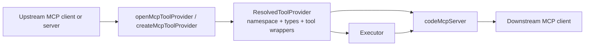
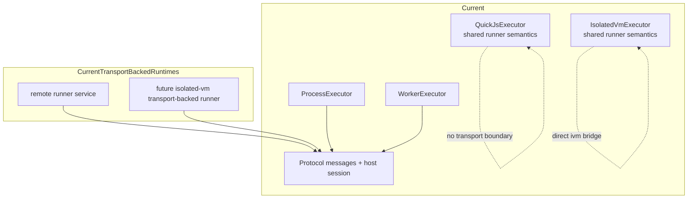

# Execbox MCP Adapters and Protocol

This page explains two related but distinct parts of the current architecture:

- MCP adapters in `@execbox/core`
- transport-safe execution seams in `@execbox/protocol`

Use this page as the overview. For the remote execution control flow, read [execbox-remote-workflow.md](./execbox-remote-workflow.md). For the message-level protocol contract, read [execbox-protocol-reference.md](./execbox-protocol-reference.md). For the normative runner specification, read [execbox-runner-specification.md](./execbox-runner-specification.md).

## MCP Wrapping Today

The MCP adapter layer lets execbox sit on either side of an MCP tool catalog:

- `createMcpToolProvider({ client })` is the convenience path for caller-owned MCP client connections
- `openMcpToolProvider({ client | server })` opens a wrapped provider handle and is required when execbox owns a local `{ server }` connection
- `codeMcpServer()` exposes execbox execution back out as MCP tools such as `mcp_execute_code`, `mcp_search_tools`, and `mcp_code`

### What the MCP Adapter Layer Adds

- discovery of upstream MCP tools through a client connection
- conversion of raw MCP tools into a resolved provider namespace
- generated namespace typings for the wrapped MCP surface
- lifecycle ownership for locally opened in-memory MCP connections
- optional wrapper server identity override when exposing execbox back out as MCP

### Ownership Model

- `{ client }` sources stay caller-owned. `createMcpToolProvider()` is the ergonomic helper for that path.
- `{ server }` sources are execbox-owned. Callers must use `openMcpToolProvider()` and close the returned handle.
- `codeMcpServer()` uses the same handle path internally and closes owned resources with the wrapper server.

## Protocol Role Today

`@execbox/protocol` is not a sandbox runtime. It is the transport-safe glue that lets a runtime and a trusted host exchange execution messages without sharing host closures.

At a high level it currently provides:

- `execute`, `cancel`, `started`, `tool_call`, `tool_result`, and `done` message types
- a shared host transport session used by worker/process executors
- transport-facing access to the shared manifest and dispatcher model from `@execbox/core`

The important architectural split is:

- `@execbox/core` owns manifest extraction and host-side tool dispatch semantics
- `@execbox/protocol` owns wire messages and the shared host session around those semantics

Detailed wire shapes, correlation rules, and lifecycle semantics now live in [execbox-protocol-reference.md](./execbox-protocol-reference.md).

## How the Current Packages Use the Protocol

Today the protocol package is already part of the merged architecture, not just a future idea:

- `ProcessExecutor` uses the shared host session across the child-process boundary.
- `WorkerExecutor` uses the shared host session across the worker-thread boundary.
- `RemoteExecutor` uses the same shared host session across an app-defined transport boundary.
- `QuickJsExecutor` does not use the protocol package directly; it shares the same runner semantics from core without crossing a transport boundary.
- `IsolatedVmExecutor` also uses the shared core runner semantics, but keeps a direct `isolated-vm` bridge instead of protocol messages.

That split is intentional today:

- the process and worker paths need a real wire protocol
- the in-process QuickJS and `isolated-vm` paths do not
- worker and process now also align on the same parent-side host session and the same child-side QuickJS protocol endpoint
- all four now align on the same core runner-level contract

## Current Shape

## Current Direction

The protocol package creates a seam for future execution shapes without changing the `Executor` contract in `@execbox/core`.

The most natural future uses are:

- a remote runner or worker fleet
- a transport-backed `isolated-vm` runner if the project later wants that consistency

What is still not merged today:

- built-in HTTP or WebSocket transport adapters
- a protocol-backed `IsolatedVmExecutor`

So the current docs should be read as:

- MCP adapters are production architecture now
- `execbox-protocol` is production architecture now
- shared runner semantics in `@execbox/core` are production architecture now
- the worker/process transport stack is production architecture now and no longer duplicates its protocol loop in each executor
- remote execution is now a shipped package when you want to supply your own transport boundary
- fleet scheduling and transport adapters remain an enabled direction, not current shipped behavior
