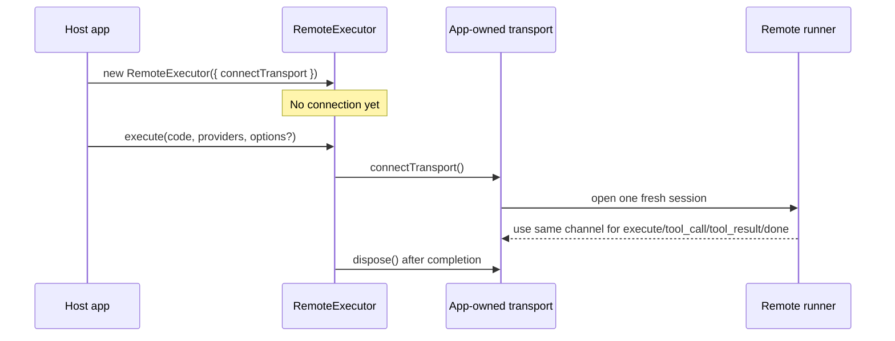
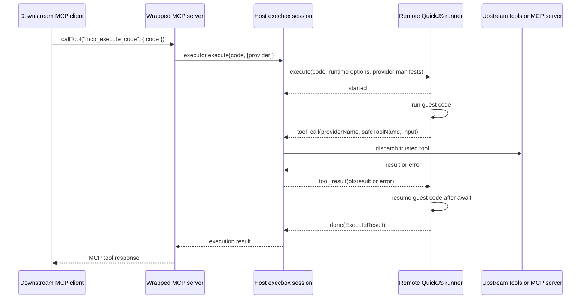

# Execbox Remote Execution Workflow

This page explains how `@execbox/remote` fits into the current execbox architecture, with emphasis on where code runs, when the transport is opened, and how guest tool calls pause and resume.

Use this page when you want the control-flow story. For the wire-format reference, read [execbox-protocol-reference.md](./execbox-protocol-reference.md). For the normative runner specification, read [execbox-runner-specification.md](./execbox-runner-specification.md).

## The Boundary In One Sentence

`RemoteExecutor` moves the guest JavaScript runtime behind an app-owned transport, but the trusted host still owns providers, tool closures, upstream MCP clients, API clients, tenant maps, and secrets.

## Main Roles

| Role                 | Lives where                         | Responsibility                                                                    |
| -------------------- | ----------------------------------- | --------------------------------------------------------------------------------- |
| Downstream client    | outside execbox                     | Calls wrapper tools such as `mcp_execute_code`                                    |
| Wrapped MCP server   | host process                        | Exposes `mcp_search_tools`, `mcp_execute_code`, and `mcp_code`                    |
| Host execbox session | host process                        | Owns the transport session, dispatches tool calls, enforces cancellation backstop |
| Remote runner        | remote runtime                      | Runs guest JavaScript and emits `tool_call` messages                              |
| Upstream tools       | host process or upstream dependency | Do the real work when a guest tool call is dispatched                             |

## Connection Lifecycle

`RemoteExecutor` does not open a connection when you construct it. It opens a fresh transport when `execute(...)` starts, uses that single bidirectional channel for the full execution, then disposes it when the execution finishes or fails.



Important implications:

- transport establishment happens per execution, not per executor instance
- the remote side does not create a separate callback connection for tool calls
- `execute`, `tool_call`, `tool_result`, `done`, and `cancel` all use the same open channel

## End-to-End Flow

The same flow works whether the provider wraps local tools or an upstream MCP server. The important split is between guest execution and trusted tool dispatch.



## Where Guest Code Pauses

Execbox does not parse JavaScript and look for tool calls ahead of time. The pause happens because injected guest tools are Promise-returning proxy functions.

When guest code runs:

```js
const toolResult = await tools.echo({ ok: true });
const message = toolResult.ok ? "done" : "failed";
```

the remote runner:

1. calls the injected proxy function for `tools.echo`
2. creates a deferred Promise for that call
3. emits `tool_call` to the host
4. suspends normal async execution at `await`
5. waits for `tool_result`
6. resolves or rejects the Promise
7. resumes the same JavaScript execution after the `await`

So the tool implementation runs on the host, but the surrounding `if`, `throw`, destructuring, and return value construction all continue in the remote runtime after the Promise settles.

## What Crosses The Remote Boundary

What is sent to the remote runner:

- the code string
- runtime limits such as timeout, memory, and log bounds
- execution id
- provider manifests: namespace name, safe tool names, descriptions, and generated types
- JSON-serializable tool inputs and outputs

What does not cross the boundary unless a tool explicitly returns or logs it:

- provider closures
- upstream MCP client instances
- API clients
- tenant maps
- API keys and other secrets

This is why the provider surface is the real capability boundary. The remote runner only sees the metadata needed to build guest-side tool proxies.

## Wrapped MCP Servers And Remote Execution

When `codeMcpServer()` is combined with `RemoteExecutor`, there are two separate protocols in play:

- MCP between downstream clients, wrapper servers, and any upstream MCP source
- execbox transport messages between the trusted host session and the remote runner

Those layers are intentionally separate:

- MCP chooses how tool catalogs are discovered or exposed
- execbox remote protocol chooses how guest JavaScript asks the trusted host to invoke a tool

That means a wrapped MCP tool can still be invoked by the host while the guest runtime itself lives remotely.

## Security Notes

- `execbox-remote` improves deployment flexibility and lets you move the runtime out of the application process.
- It does not make the remote runner the capability owner. The host-side provider surface still decides what guest code can do.
- Secrets stay host-side as long as host tool implementations do not return or log them.
- The actual trust boundary depends on the runtime and infrastructure you deploy behind the transport, not on the protocol alone.
