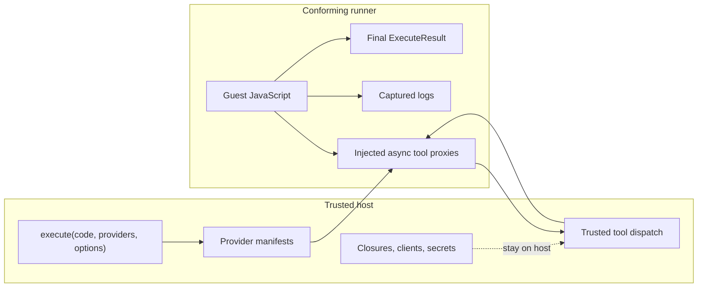
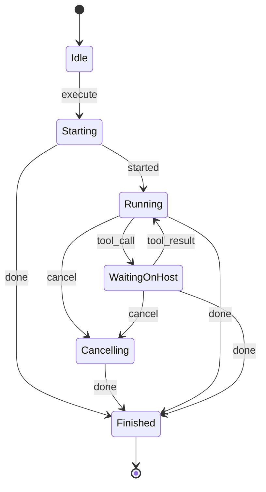

# Execbox Runner Specification

This page defines the runner specification for transport-backed execbox runners.

Use it when you want to implement a non-TypeScript runner, such as a Go remote runner, without reverse-engineering the shipped TypeScript implementation. For the control-flow walkthrough, read [execbox-remote-workflow.md](./execbox-remote-workflow.md). For the message catalog, read [execbox-protocol-reference.md](./execbox-protocol-reference.md).

## Table of Contents

- [Status And Scope](#status-and-scope)
- [Core Model](#core-model)
- [Session Model](#session-model)
- [Inputs To The Runner](#inputs-to-the-runner)
- [Guest Namespace Contract](#guest-namespace-contract)
- [Tool Call Contract](#tool-call-contract)
- [Serialization Contract](#serialization-contract)
- [Logs](#logs)
- [Final Result Contract](#final-result-contract)
- [Cancellation And Transport Failure](#cancellation-and-transport-failure)
- [Execution Id And Message Correlation](#execution-id-and-message-correlation)
- [Minimal Success Transcript](#minimal-success-transcript)
- [Minimal Cancellation Transcript](#minimal-cancellation-transcript)

## Status And Scope

This is the normative runner specification for the execbox runner contract.

It defines:

- the execution lifecycle a conforming runner must implement
- what crosses the host/runner boundary
- how guest-visible tools behave
- how results, logs, cancellation, and failures must surface

It does not define:

- a built-in network transport such as HTTP or WebSocket
- authentication, tenancy, or deployment policy
- how a runner internally embeds JavaScript

A conforming runner may use a different language or engine internally, as long as its externally visible behavior matches this contract.

## Core Model

Execbox splits responsibility between a trusted host and an untrusted or less-trusted runner:

- the host owns providers, tool closures, validation, upstream clients, API clients, and secrets
- the runner owns guest JavaScript execution, guest-visible tool proxies, console capture, and final result emission



The runner never receives host closures or secrets. It only receives code, runtime options, and provider metadata.

## Session Model

A transport-backed runner covered by this specification is single-execution and single-session:

- one transport session carries exactly one active execution
- the transport is bidirectional and sustained for the lifetime of that execution
- the host may open a fresh transport per execution
- the runner must not require a second callback connection for tool calls

If the runner receives a second `execute` while one execution is active, it should reject that new request with a terminal `done` carrying `internal_error`.

### State Machine



Specification rules:

- a successful session must end with exactly one `done`
- `started` should be emitted once after the runner accepts `execute` and before any `tool_call` or `done`
- `tool_call` and `tool_result` may repeat zero or more times before `done`
- after `done`, the session is complete and no further protocol messages are valid for that execution

## Inputs To The Runner

The runner receives one `execute` message:

```ts
{
  type: "execute";
  id: string;
  code: string;
  options: ExecutorRuntimeOptions;
  providers: ProviderManifest[];
}
```

Requirements:

- `id` identifies the execution session
- `code` is the full guest JavaScript program to run
- `options` carries timeout, memory, and log limits
- `providers` is metadata only; it is not executable capability

The runner must not assume any provider manifest contains:

- host closures
- upstream MCP clients
- tenant maps
- API keys or other secrets

## Guest Namespace Contract

Each `ProviderManifest` becomes one guest-visible global namespace whose property names are the manifest tool `safeName` values.

For a provider manifest like:

```ts
{
  name: "firecrawl",
  tools: {
    scrape_url: {
      safeName: "scrape_url",
      originalName: "scrape-url"
    }
  },
  types: "declare namespace firecrawl { ... }"
}
```

the guest runtime must expose:

```js
await firecrawl.scrape_url(input);
```

Injected-tool requirements:

- each tool must be an async or Promise-returning function
- only the first guest argument is transported as tool input
- omitted input is treated as `undefined`
- the emitted tool input must be transport-safe
- the proxy must suspend normal async execution until a matching `tool_result` arrives

### Pause/Resume Semantics

When guest code runs:

```js
const page = await firecrawl.scrape_url({ url: "https://example.com" });
const title = page.title ?? null;
```

the conforming runner must:

1. create a pending Promise for that tool call
2. emit `tool_call`
3. let JavaScript pause at the `await`
4. wait for a `tool_result` with the same `callId`
5. resolve or reject the pending Promise
6. resume the same guest execution after the `await`

This pause is normal JavaScript Promise suspension, not a source-to-source rewrite pass.

## Tool Call Contract

Each guest tool invocation emits:

```ts
{
  type: "tool_call";
  callId: string;
  providerName: string;
  safeToolName: string;
  input: unknown;
}
```

Specification rules:

- `callId` must uniquely identify one tool invocation within the execution
- `providerName` and `safeToolName` must match the injected namespace/tool pair
- the runner must not emit a second `tool_call` with the same `callId`

The host responds with exactly one matching `tool_result`:

```ts
{
  type: "tool_result";
  callId: string;
  ok: true;
  result: unknown;
}
```

or:

```ts
{
  type: "tool_result";
  callId: string;
  ok: false;
  error: {
    code: ExecuteErrorCode;
    message: string;
  }
}
```

Specification rules:

- `tool_result.callId` must correlate exactly one pending tool Promise
- a successful `tool_result` resolves the Promise to `result`
- a failing `tool_result` rejects the Promise with an Error-like value whose `.message` is the trusted host message and whose `.code` is the trusted host error code
- trusted host-originated tool failures must remain distinguishable from guest-created errors so the final uncaught result can preserve the trusted host error code

## Serialization Contract

Every value that crosses the host/runner boundary must be transport-safe.

The current runner specification allows:

- `undefined` for omitted tool input and successful expressions that evaluate to `undefined`
- `null`
- strings
- booleans
- finite numbers
- arrays of serializable values
- plain objects with serializable values

The runner specification rejects:

- `bigint`
- functions
- symbols
- non-finite numbers
- cyclic values
- non-plain objects as transported results

Requirements:

- non-serializable tool inputs must not be surfaced to the host as successful structured values
- non-serializable tool results must surface as `serialization_error`
- non-serializable final guest results must surface as `serialization_error`

### JSON Transport Note

The protocol types are defined as JavaScript values, but many real transports will serialize them as JSON.

Guidance for JSON-backed transports:

- omitted tool input may be represented by a missing `input` field and interpreted as `undefined`
- a successful final result of `undefined` may be represented by an omitted `result` field when `ok: true`
- a failed result still requires an explicit `error`

## Logs

Logs are captured runner-side and returned in the terminal `done` message as `string[]`.

Requirements:

- expose `console.log`, `console.info`, `console.warn`, and `console.error`
- each call appends one log line
- one log line is the space-joined formatting of the console arguments
- `undefined` formats as the literal string `undefined`
- non-string values should be JSON-stringified when possible, with fallback string conversion when needed

### Truncation

Log truncation is externally visible behavior and is part of this specification:

- first apply `maxLogLines` by keeping only the earliest lines up to the limit
- then apply `maxLogChars` cumulatively across those remaining lines
- if the character limit is reached in the middle of a line, that final line is clipped
- truncated logs are returned from `done`

## Final Result Contract

The runner must terminate with one `done` message:

```ts
{
  type: "done";
  id: string;
  ok: boolean;
  durationMs: number;
  logs: string[];
  result?: unknown;
  error?: {
    code: ExecuteErrorCode;
    message: string;
  };
}
```

Requirements:

- `id` must match the active execution id
- exactly one of `result` or `error` must be present according to `ok`
- `logs` must be a `string[]`
- `durationMs` must measure execution wall time for that run
- `result` must be transport-safe, with omitted `result` interpreted as `undefined` on successful JSON-serialized responses

### Stable Error Codes

A conforming runner must use the current public error code set:

- `timeout`
- `memory_limit`
- `validation_error`
- `tool_error`
- `runtime_error`
- `serialization_error`
- `internal_error`

### Error Mapping Rules

Terminal-failure requirements:

- trusted host tool failures may surface as their trusted host code when uncaught by guest code
- guest-thrown values must not be upgraded into trusted host errors solely because their text mentions timeout or memory
- timeout must be reserved for real timeout or cancellation behavior
- memory-limit classification must be reserved for real runtime memory failures
- unknown or unexpected runner failures should surface as `internal_error` or `runtime_error`, not as a forged trusted host error

## Cancellation And Transport Failure

The host may send:

```ts
{
  type: "cancel";
  id: string;
}
```

Requirements:

- if `id` matches the active execution, the runner must promptly abort execution
- pending guest tool awaits should reject promptly so the execution can unwind
- cancellation should result in a terminal timeout-shaped failure for the caller

Host-session semantics that a conforming runner must tolerate:

- `cancel` may arrive before any `tool_call`
- `cancel` may arrive while the runner is waiting on a `tool_result`
- the host may force-terminate the transport shortly after `cancel` if the runner does not finish
- unexpected transport close or transport error before `done` is terminal for the session

## Execution Id And Message Correlation

Specification rules:

- `id` identifies the execution session
- `callId` identifies one tool invocation inside that session
- the host may ignore runner messages whose `id` does not match the active execution
- the runner must match `tool_result` by `callId`
- after a tool Promise settles, the associated `callId` is no longer active

## Minimal Success Transcript

```json
{"type":"execute","id":"exec-1","code":"const value = await tools.echo({\"ok\":true}); value.ok","options":{"timeoutMs":1000,"memoryLimitBytes":67108864,"maxLogLines":100,"maxLogChars":64000},"providers":[{"name":"tools","tools":{"echo":{"safeName":"echo","originalName":"echo","description":"Echo input"}},"types":"declare namespace tools { ... }"}]}
{"type":"started","id":"exec-1"}
{"type":"tool_call","callId":"call-1","providerName":"tools","safeToolName":"echo","input":{"ok":true}}
{"type":"tool_result","callId":"call-1","ok":true,"result":{"ok":true}}
{"type":"done","id":"exec-1","ok":true,"durationMs":3,"logs":[],"result":true}
```

## Minimal Cancellation Transcript

```json
{"type":"execute","id":"exec-2","code":"await tools.hang({})","options":{"timeoutMs":1000,"memoryLimitBytes":67108864,"maxLogLines":100,"maxLogChars":64000},"providers":[{"name":"tools","tools":{"hang":{"safeName":"hang","originalName":"hang"}},"types":"declare namespace tools { ... }"}]}
{"type":"started","id":"exec-2"}
{"type":"tool_call","callId":"call-9","providerName":"tools","safeToolName":"hang","input":{}}
{"type":"cancel","id":"exec-2"}
{"type":"done","id":"exec-2","ok":false,"durationMs":1005,"logs":[],"error":{"code":"timeout","message":"Execution timed out"}}
```
