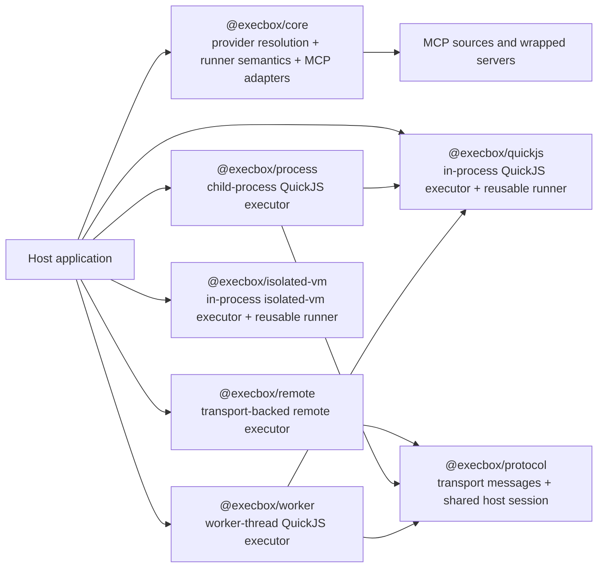

# Execbox Architecture Overview

Execbox is the code-execution part of the `execbox` workspace. It turns host tool catalogs into callable guest namespaces, lets those namespaces wrap MCP tools, and pairs with executor packages that decide where and how guest JavaScript runs.

This doc set is for two audiences:

- integrators choosing packages and deployment shapes
- contributors reasoning about package boundaries, control flow, and trade-offs

## Reading guide

- Start here for the package map, trust model, and overall flow.
- Read [Core](/architecture/execbox-core) for provider resolution, execution contracts, and error handling.
- Read [Executors](/architecture/execbox-executors) for QuickJS, process, worker-thread, and `isolated-vm` trade-offs.
- Read [MCP And Protocol](/architecture/execbox-mcp-and-protocol) for MCP wrapping and where `execbox-protocol` fits.
- Read [Remote Workflow](/architecture/execbox-remote-workflow) for the end-to-end remote execution control flow.
- Read [Protocol Reference](/architecture/execbox-protocol-reference) for the protocol message catalog and session rules.
- Read [Runner Specification](/architecture/execbox-runner-specification) for the normative runner specification for non-TypeScript runners.

## Package map

## End-to-end execution model

At a high level, execbox always follows the same model:

1. Host code defines or discovers tools.
2. `@execbox/core` resolves those tools into a deterministic guest namespace.
3. An executor runs guest JavaScript against that resolved namespace.
4. Guest tool calls cross a host-controlled boundary and return structured JSON-compatible results.

## Trust model and security posture

Execbox reduces accidental exposure, but it does not claim a hard security boundary for hostile code in its default deployment model.

Key implications:

- The real capability boundary is the provider/tool surface, not the JavaScript syntax itself.
- Fresh runtimes, schema validation, JSON-only boundaries, timeouts, memory limits, and bounded logs are defense-in-depth features.
- In-process execution still shares the host process. Use a separate process, container, VM, or similar boundary when the code source is hostile or multi-tenant.
- Wrapping third-party MCP servers is a separate dependency-trust decision from letting end users author guest code.
