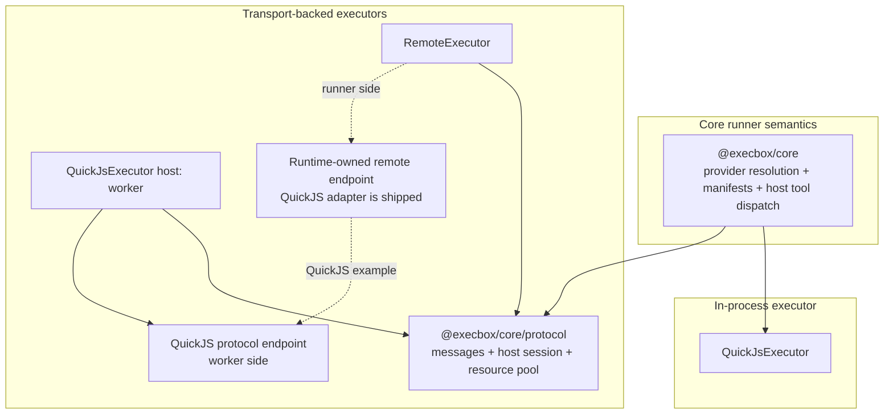
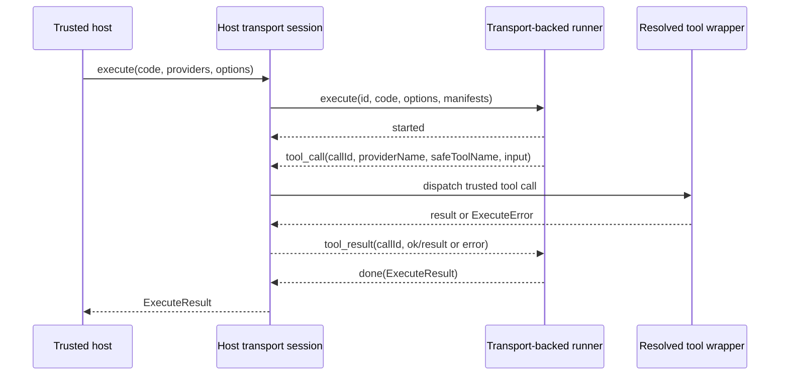

This page covers two related but separate parts of the execbox architecture:

- MCP adapters in `@execbox/core`
- transport-safe execution plumbing in `@execbox/core/protocol`

Use this page as the overview. For the remote execution control flow, read [Remote Workflow](/architecture/execbox-remote-workflow/). For the message-level protocol contract, read [Protocol Reference](/architecture/execbox-protocol-reference/). For the normative runner specification, read [Runner Specification](/architecture/execbox-runner-specification/).

## MCP Adapter Responsibilities

The MCP adapter layer lets execbox sit on either side of an MCP tool catalog:

- `createMcpToolProvider({ client })` wraps caller-owned MCP client connections as execbox providers
- `openMcpToolProvider({ client | server })` opens a provider handle and is required when execbox owns a local `{ server }` connection
- `codeMcpServer()` exposes execbox execution back out as MCP tools such as `mcp_execute_code`, `mcp_search_tools`, and `mcp_code`

### Ownership Model

- `{ client }` sources stay caller-owned. `createMcpToolProvider()` is the ergonomic helper for that path.
- `{ server }` sources are execbox-owned. Callers use `openMcpToolProvider()` and close the returned handle.
- `codeMcpServer()` uses the same handle path internally and closes any resources it owns with the wrapper server.

## Protocol Responsibilities

`@execbox/core/protocol` is not a sandbox runtime. It provides the transport-safe layer that lets a trusted host and a runtime exchange execution messages without sharing host closures.

It owns:

- the `execute`, `cancel`, `started`, `tool_call`, `tool_result`, and `done` message types
- the shared host transport session used by worker-hosted `@execbox/quickjs` and `@execbox/remote`
- Node transport bootstrap helpers for worker execution
- the reusable async resource pool used by pooled worker shells

The architecture split is:

- `@execbox/core` owns app-facing provider resolution and MCP adapters
- `@execbox/core/runtime` owns manifest extraction and host-side tool dispatch helpers for runtime implementers
- `@execbox/core/protocol` owns wire messages, host-session lifecycle, and host-side shell pooling utilities around those semantics

## How The Packages Fit Together

- `QuickJsExecutor` uses the shared runner semantics from `@execbox/core/runtime` directly.
- `QuickJsExecutor` in `host: "worker"` mode uses the shared host session from `@execbox/core/protocol` plus the shared QuickJS protocol endpoint inside the worker shell.
- `RemoteExecutor` uses that same host session across an app-owned transport boundary.
- The runner side of a remote deployment attaches a runtime-owned endpoint adapter; `@execbox/quickjs/remote-endpoint` is the shipped QuickJS adapter.
- Pooled worker execution reuses only the outer host shell. Each `execute()` call still starts a fresh QuickJS runtime through the shared protocol endpoint.

## Transport-Backed Execution Flow

The same host-session model is used for worker-hosted QuickJS and remote execution:

Important implications:

- tool closures and secrets stay on the host side
- runners only receive code, runtime options, provider metadata, and JSON-safe tool inputs and results
- the host session is responsible for timeout backstops, caller cancellation, transport failure handling, and tool-call correlation

## Boundaries And Trust

- MCP adapters decide how tool catalogs are discovered, wrapped, and re-exposed.
- The protocol decides how a transport-backed runtime asks the trusted host to invoke those tools.
- The provider surface remains the real capability boundary.
- Transport-backed execution changes where guest code runs, not who owns host capabilities.
