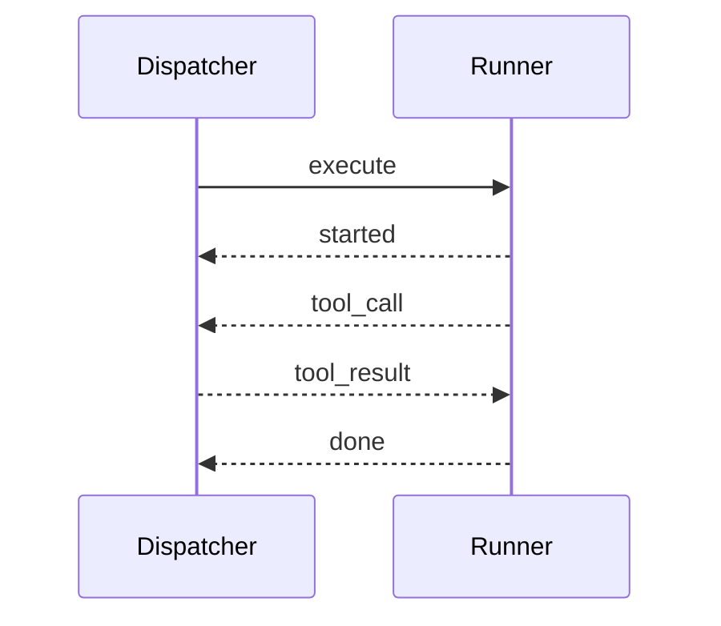

This page is the message-level reference for `@execbox/core/protocol`.

It describes the wire shapes and session semantics used by worker-hosted
QuickJS. This is an advanced reference for execbox runtime maintainers; most
application users should start with [Getting Started](/getting-started/),
[Providers & Tools](/providers-and-tools/), [Runtime Choices](/runtime-choices/),
and [Security & Boundaries](/security/).

## Table of Contents

- [Purpose](#purpose)
- [Message Directions](#message-directions)
- [Message Catalog](#message-catalog)
- [Correlation Rules](#correlation-rules)
- [Provider Manifest Contract](#provider-manifest-contract)
- [Session Lifecycle](#session-lifecycle)
- [Cancellation And Failure Semantics](#cancellation-and-failure-semantics)
- [JSON And Trust Boundaries](#json-and-trust-boundaries)
- [Minimal Transcript](#minimal-transcript)
- [Scope Of This Reference](#scope-of-this-reference)

## Purpose

The protocol exists so a trusted host can run guest JavaScript behind a message boundary without serializing host closures into the runtime.

At a high level:

- the dispatcher sends `execute`
- the runner emits `started`
- guest tool calls become `tool_call`
- trusted host results come back as `tool_result`
- final execution completes with `done`
- cancellation uses `cancel`

## Message Directions

| Message       | Direction            | Purpose                                             |
| ------------- | -------------------- | --------------------------------------------------- |
| `execute`     | dispatcher -> runner | Start one execution session                         |
| `cancel`      | dispatcher -> runner | Request prompt cancellation of the active execution |
| `started`     | runner -> dispatcher | Acknowledge that guest execution has started        |
| `tool_call`   | runner -> dispatcher | Ask the trusted host to invoke one tool             |
| `tool_result` | dispatcher -> runner | Deliver the trusted host result for one tool call   |
| `done`        | runner -> dispatcher | Return the final `ExecuteResult`                    |

## Message Catalog

### `execute`

Sent once at the start of a host transport session.

```ts
{
  type: "execute";
  id: string;
  code: string;
  options: ExecutorRuntimeOptions;
  providers: ProviderManifest[];
}
```

Fields:

- `id`: execution correlation id for the session
- `code`: full guest JavaScript source
- `options`: runtime limits forwarded to the runner
- `providers`: transport-safe namespace metadata used to inject guest tool proxies

### `cancel`

Sent when the caller aborts or the host timeout backstop triggers.

```ts
{
  type: "cancel";
  id: string;
}
```

Fields:

- `id`: execution id of the active session to cancel

### `started`

Emitted by the runner after it has accepted the execution and started timing guest execution.

```ts
{
  type: "started";
  id: string;
}
```

Fields:

- `id`: execution id of the session that has started

### `tool_call`

Emitted whenever guest code invokes an injected host tool.

```ts
{
  type: "tool_call";
  callId: string;
  providerName: string;
  safeToolName: string;
  input: unknown;
}
```

Fields:

- `callId`: correlation id for exactly one tool call
- `providerName`: guest-visible namespace name
- `safeToolName`: sanitized guest-visible tool name
- `input`: JSON-serializable guest input payload

### `tool_result`

Sent by the dispatcher in response to one `tool_call`.

Success shape:

```ts
{
  type: "tool_result";
  callId: string;
  ok: true;
  result: unknown;
}
```

Failure shape:

```ts
{
  type: "tool_result";
  callId: string;
  ok: false;
  error: {
    code: string;
    message: string;
  }
}
```

Fields:

- `callId`: must match the original `tool_call`
- `ok`: distinguishes trusted success from trusted failure
- `result`: JSON-serializable tool result when successful
- `error`: trusted execution error when unsuccessful

### `done`

Final message for the execution.

```ts
{
  type: "done";
  id: string;
  ok: boolean;
  durationMs: number;
  logs: string[];
  result?: unknown;
  error?: {
    code: string;
    message: string;
  };
}
```

This is the normal execbox `ExecuteResult` plus the session `id`.

## Correlation Rules

Two ids are used for different scopes:

- `id` tracks one full execution session
- `callId` tracks one tool invocation inside that execution

Host-session behavior:

- runner messages are accepted only when their `id` matches the active session
- `tool_result` is correlated by `callId`
- `done` settles the execution and ends the session

## Provider Manifest Contract

`execute.providers` is built from `ResolvedToolProvider[]` and carries only transport-safe metadata:

```ts
{
  name: string;
  tools: Record<
    string,
    {
      safeName: string;
      originalName: string;
      description?: string;
    }
  >;
  types: string;
}
```

The manifest includes only runtime-safe metadata. Host-owned values stay on the trusted side:

- executable host closures
- upstream client objects
- API clients
- secrets or tenant maps

The runner uses this metadata only to inject guest-visible namespaces and Promise-returning proxy functions.

## Session Lifecycle



Not every execution emits `tool_call`, but every successful protocol session is expected to end with `done` unless the transport fails first.

## Cancellation And Failure Semantics

Host-session behavior:

- caller abort or timeout sends `cancel`
- host also aborts its own tool-dispatch signal immediately
- the host may terminate the transport after the configured cancel grace window
- unexpected transport close or transport error fails the session

Important nuance:

- `cancel` requests prompt termination; runners may need a short grace window to stop
- timeout classification is still decided by trusted host logic, not by guest-thrown error strings

## JSON And Trust Boundaries

The protocol assumes JSON-safe payloads across the boundary.

Trusted host guarantees:

- host tool dispatch validates and classifies tool failures before sending `tool_result`
- non-serializable host values are rejected before they are sent back to the runner
- guest runtime receives proxy metadata while host closures stay on the trusted side

Runner guarantees:

- guest tool proxies only emit transport messages
- guest code resumes only after a trusted `tool_result` is received

## Minimal Transcript

Example execution with one tool call:

```json
{"type":"execute","id":"exec-1","code":"await tools.echo({\"ok\":true})","options":{"timeoutMs":1000,"memoryLimitBytes":67108864,"maxLogLines":100,"maxLogChars":64000},"providers":[{"name":"tools","tools":{"echo":{"safeName":"echo","originalName":"echo","description":"Echo input"}},"types":"declare namespace tools { ... }"}]}
{"type":"started","id":"exec-1"}
{"type":"tool_call","callId":"call-1","providerName":"tools","safeToolName":"echo","input":{"ok":true}}
{"type":"tool_result","callId":"call-1","ok":true,"result":{"ok":true}}
{"type":"done","id":"exec-1","ok":true,"durationMs":3,"logs":[],"result":{"ok":true}}
```

## Scope Of This Reference

This reference describes the message contract and host-session semantics used inside the execbox package family. Application deployments own the surrounding operational policy:

- transport selection
- session ownership and channel lifecycle
- authentication, tenancy, and deployment policy
- compatibility policy for external runner implementations
