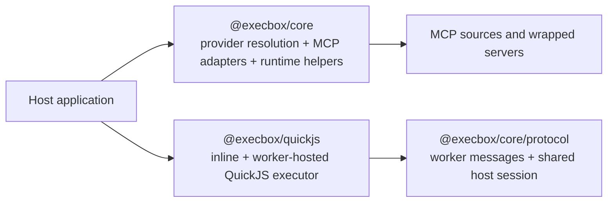

Execbox is the code-execution part of the `execbox` workspace. It turns host tool catalogs into callable guest namespaces, lets those namespaces wrap MCP tools, and uses executor backends that decide where and how guest JavaScript runs.

This Concepts section is for library users choosing how to integrate execbox:

- start here when you need the package map, trust model, and overall flow
- use the deeper pages when you are choosing a runtime, wrapping MCP tools, or understanding the worker protocol

## Reading guide

- Start here for the package map, trust model, and overall flow.
- Read [Core](/architecture/execbox-core/) for provider resolution, execution contracts, and error handling.
- Read [Executors](/architecture/execbox-executors/) for inline QuickJS and worker-hosted QuickJS trade-offs.
- Read [MCP And Protocol](/architecture/execbox-mcp-and-protocol/) for MCP wrapping and where `@execbox/core/protocol` fits.
- Read [Protocol Reference](/architecture/execbox-protocol-reference/) for the protocol message catalog and session rules.
- Read [Security & Boundaries](/security/) before choosing a production trust boundary.
- Read [Performance](/performance/) for latency, pooling, and executor sizing guidance.

## Package map

## End-to-end execution model

At a high level, execbox always follows the same model:

1. Host code defines or discovers tools.
2. `@execbox/core` resolves those tools into a deterministic guest namespace.
3. An executor runs guest JavaScript against that resolved namespace.
4. Guest tool calls cross a host-controlled boundary and return structured JSON-compatible results.

## Trust model and security posture

Execbox provides defense-in-depth controls around guest execution, but hard isolation still depends on the executor and deployment boundary you choose.

Key implications:

- The provider/tool surface is the capability boundary, not the JavaScript syntax itself.
- Fresh runtimes, schema validation, JSON-only boundaries, timeouts, memory limits, and bounded logs are defense-in-depth features.
- In-process and worker-hosted execution share the host process. For hostile-code or multi-tenant deployments, run the application-level execution service behind a process, container, VM, or equivalent operational boundary.
- Wrapping third-party MCP servers is a separate dependency-trust decision from letting end users author guest code.
