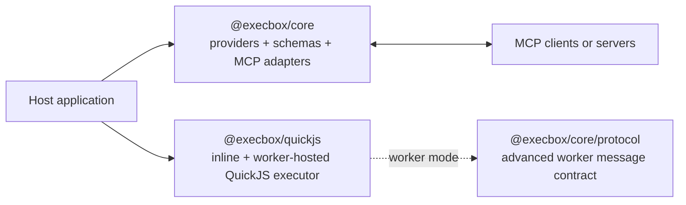
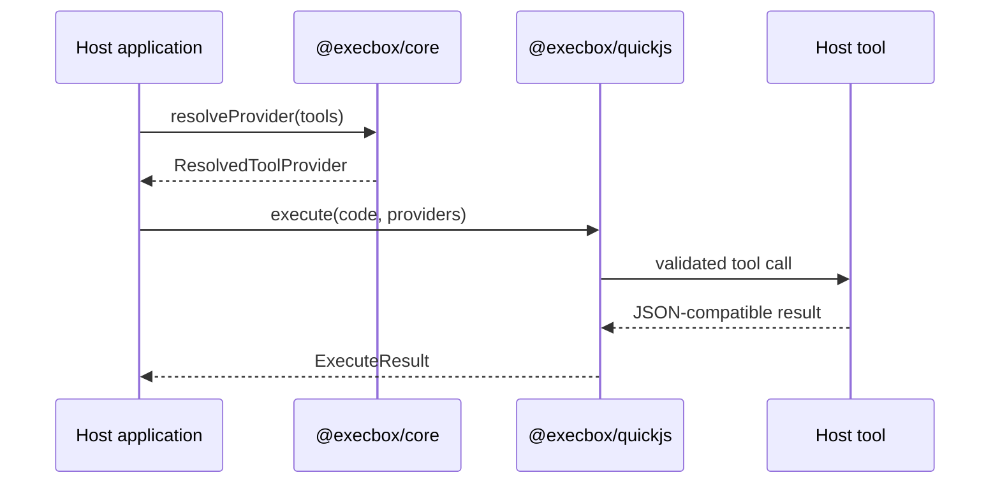

Execbox has two adopter-facing packages. `@execbox/core` owns provider and MCP
contracts. `@execbox/quickjs` owns inline and worker-hosted QuickJS execution.

## Package map

## Execution flow

The normal library flow is:

1. Host code defines tools or wraps an MCP catalog.
2. `@execbox/core` resolves those tools into a deterministic guest namespace.
3. `@execbox/quickjs` runs guest JavaScript against the resolved namespace.
4. Guest tool calls cross back to trusted host tool implementations.
5. The executor returns a stable `ExecuteResult` envelope.

## Worker-hosted flow

Worker-hosted QuickJS keeps host tools on the trusted host side. The worker
receives code, runtime options, and provider metadata; host tool closures stay
in the application process and are invoked through the shared protocol session.

`@execbox/core/protocol` documents that message contract for execbox runtime
maintainers. Most application users only need the `QuickJsExecutor` worker mode
described in [Runtime Choices](/runtime-choices/).

## Where to go next

- [Providers & Tools](/providers-and-tools/) for the provider boundary
- [Runtime Choices](/runtime-choices/) for inline and worker-hosted QuickJS
- [MCP Integration](/mcp-integration/) for MCP adapters and wrapper tools
- [Protocol](/architecture/execbox-protocol-reference/) for the advanced worker
  message reference
